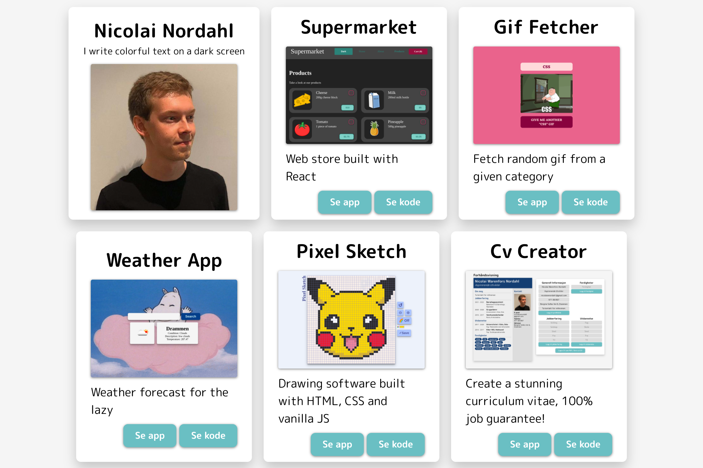

# Portfolio

A collection of the things I have built

# Idéer

- Legge bio som en snakkeboble på profilbilde
- Kun hente repos som er hostet på GitHub pages (og som ikke er forket) [*]
- Sortere etter repos som har blitt oppdatert sist [*]
- Legge til bilde i readme i all prosjekter, og hente bilde ut [*]
- Hente annen informasjon fra readme
- Vise tags knyttet til prosjektene
- Få et tilfeldig prosjekt
- Sortere i ulike kategorier
- Fikse titler i prosjektene (mellomrom i stedet for bindestrek, og stor bokstav for hvert ord) [*]
- Legge til dark theme